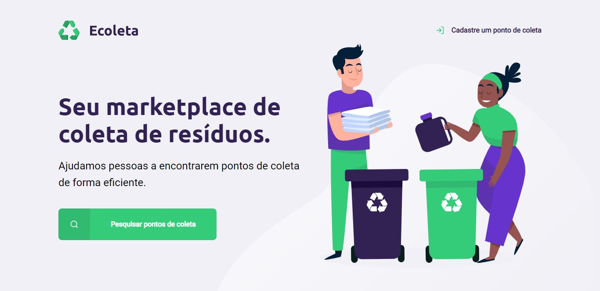

<h1 align="center">
    
</h1>

<h4 align="center">
  :recycle: ECOLETA - Next Level Week 1
</h4>

 
 
  

  
  
  

  

  

  <a href="#-tecnologias">Tecnologias</a>&nbsp;&nbsp;&nbsp;|&nbsp;&nbsp;&nbsp;
  <a href="#-projeto">Projeto</a>&nbsp;&nbsp;&nbsp;|&nbsp;&nbsp;&nbsp;
  <a href="#-layout">Layout</a>&nbsp;&nbsp;&nbsp;|&nbsp;&nbsp;&nbsp;
  <a href="#-como-contribuir">Como contribuir</a>&nbsp;&nbsp;&nbsp;|&nbsp;&nbsp;&nbsp;
  <a href="#memo-licença">Licença</a>

  

## :rocket: Tecnologias

Esse projeto foi desenvolvido com as seguintes tecnologias:

- [React](https://reactjs.org)
- [TypeScript](https://www.typescriptlang.org/)
- [Node.js](https://nodejs.org/en/)
- [Knex](http://knexjs.org/)
- [SQLite](https://www.sqlite.org/index.html)
- [React Native](https://facebook.github.io/react-native/)
- [Expo](https://expo.io/)

## :computer: Projeto

O Ecoleta é um projeto que conectar pontos de coleta de resíduos com pessoas.

   >
:factory: &nbsp;&nbsp;&nbsp;&nbsp;./server - API REST usando TypeScript, Express e banco de dados SQLite 

   >
:spider_web:  &nbsp;&nbsp;&nbsp;&nbsp;./web - Interface web em RectJS e TypeScript 

   >
:iphone: &nbsp;&nbsp;&nbsp;&nbsp;./mobile - Interface mobile em ReactNative, TypeScript e Expo 

  
Aplicação web construída na trilha <strong>Booster</strong> da <strong>Next Level Week 1</strong> distribuída pela [Rocketseat](https://rocketseat.com.br/).

## :bookmark: Layout

## :thinking: Como contribuir

## :memo: Licença

